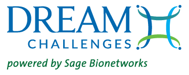
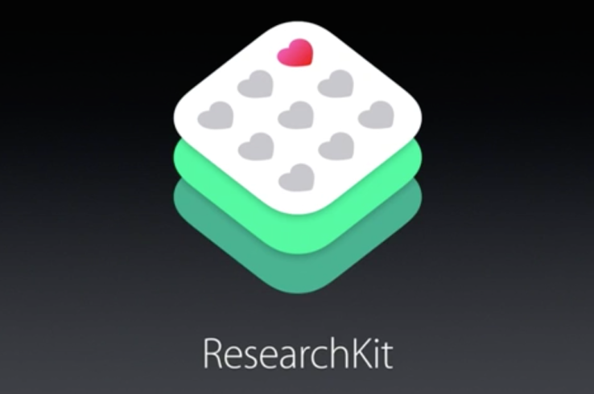
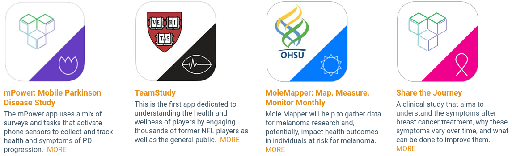
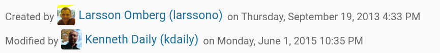
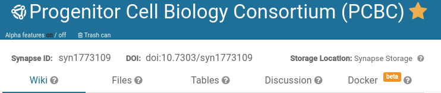
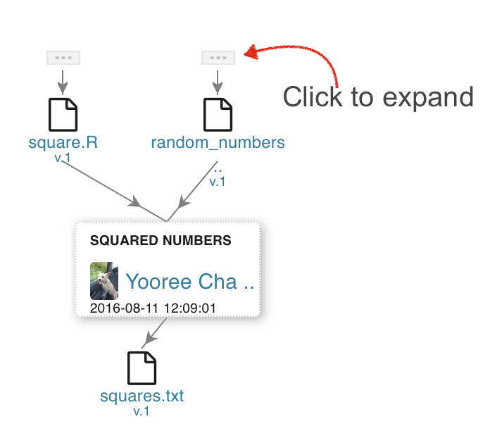
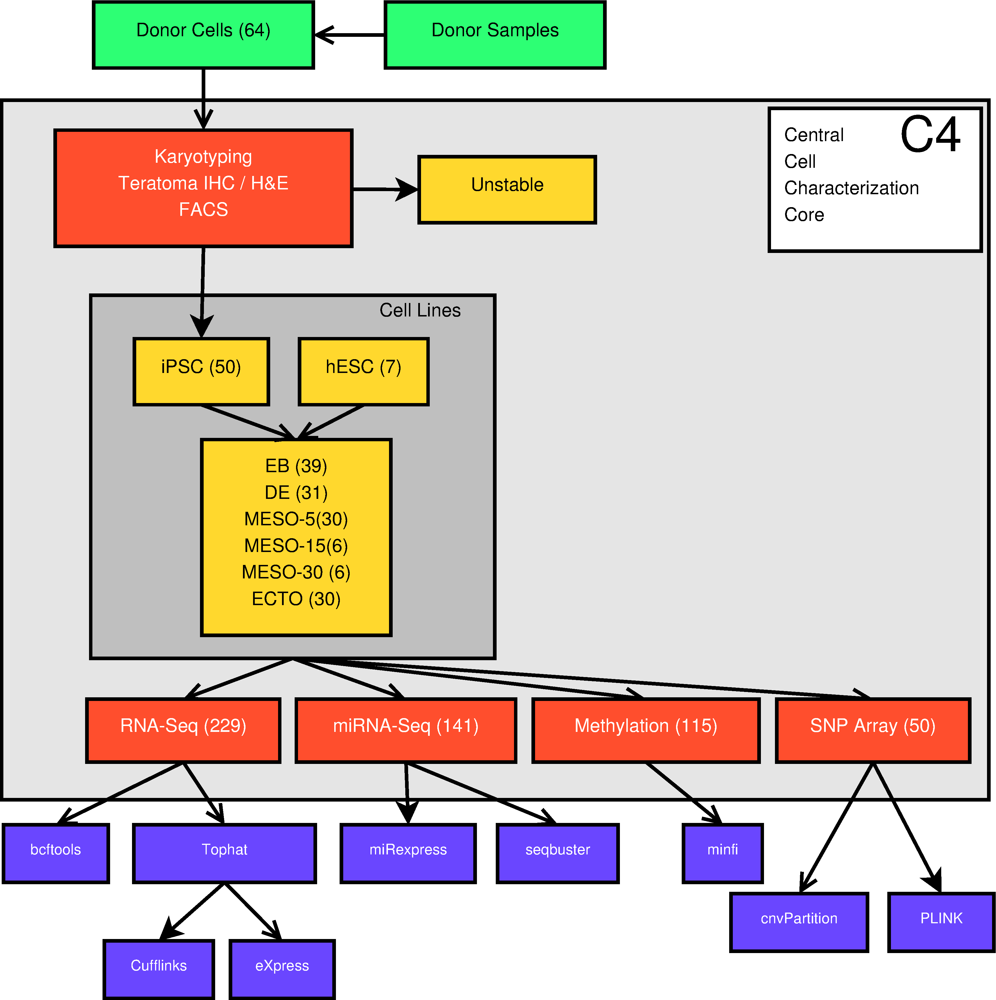
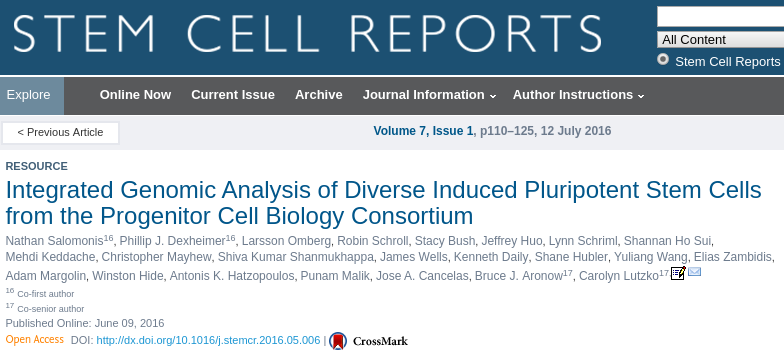
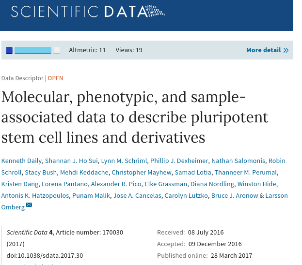
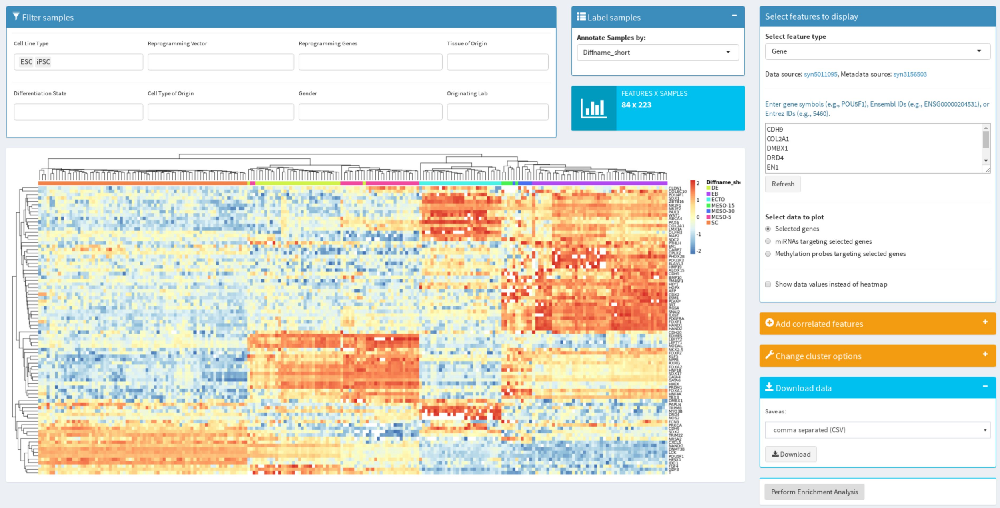

```{r setup, include=FALSE}
knitr::opts_chunk$set(echo = FALSE)
```

## Who am I?

## {data-background="img/iu_sample_gates.png"}

## {data-background="img/uci.png"}

## {data-background="img/nih_clinical_center.png"}

## {data-background="img/seattle.png"}

## 

- Non-profit biomedical research institute
- Founded in 2007
- $<50$ employees

<br/>

> We work to redefine how complex biological data is gathered, shared and used, redefining it through open systems, incentives, and norms.

## Our focus

> Engage <span style="color: #177bad">**diverse communities**</span> of researchers around biological and analytical problems too complex for a single institution

<br/>

> Empower <span style="color: #177bad">**citizens**</span> to track their own health and <span style="color: #177bad">**contribute**</span> deep phenotypic data to research topics important to them

## What I do @ Sage

- Community/program management and development
- Bioinformatics best practices for sharing and reproducible research
- Software development and testing
- Data analysis, genomics, statistics

## Our work

- **Community Building (in disease research)**
- DREAM Challenges (crowdsourced methods development)
- Mobile Health (development for personal medicine)

> All of these involve software and people development.

## 

- Collaborative discovery to accelerate science.
- Challenges for Scientists by Scientists.
- Open data. Open discovery.

## 

- [ICGC-TCGA DREAM Somatic Mutation Calling – RNA Challenge (SMC-RNA)](https://www.synapse.org/#!Synapse:syn2813589)
- [ENCODE-DREAM in vivo Transcription Factor Binding Site Prediction Challenge](https://www.synapse.org/#!Synapse:syn6131484/wiki/402026)
- [The Digital Mammography DREAM Challenge](https://www.synapse.org/#!Synapse:syn4224222/wiki/401743)
- [ICGC-TCGA DREAM Somatic Mutation Calling – RNA Challenge](https://www.synapse.org/#!Synapse:syn2813589/wiki/401435)
- [Disease Module Identification DREAM Challenge](https://www.synapse.org/#!Synapse:syn6156761)
- [ICGC-TCGA DREAM Somatic Mutation Calling Challenge – Tumour Heterogeneity & Evolution](https://www.synapse.org/#!Synapse:syn2813581/wiki/303137)

## Mobile Health

> Building on open frameworks to create powerful apps for medical research




## 


> A technology platform designed to support biomedical research studies conducted though smartphones and other sensor devices.

## Mobile apps



## Governance {data-background="img/6360179693_bc1c5171a3_b.jpg"}

> Data is a gift, which requires <span style="color: #177bad">**informed consent**</span>, Both for data contributors and data accessors!

<span style="font-size: small">https://www.flickr.com/photos/liasuxxx/6360179693/</span>

## Communities - Neurological disorders {data-background='img/brain_coral.jpg'}

- [[**AMP**|**MOVE**|**MODEL**]-AD (Alzheimer's Disease)](https://www.synapse.org/ampad)
- [**B**rain **S**omatic **M**osaicism **N**etwork](https://www.synapse.org/bsmn)
- [PsychENCODE](https://www.synapse.org/#!Synapse:syn4921369)
- [CommonMind Consortium](https://www.synapse.org/cmc)

<span style="font-size: small">https://www.flickr.com/photos/76940219@N03/6918270325/</span>

## Communities - Cancer

- [The Cancer Genome Atlas Pan-cancer](https://www.synapse.org/#!Synapse:syn300013/)
- [Synodos/**C**hildren's **T**umor **F**oundation (Neurofibromatosis)](https://www.synapse.org/#!Synapse:syn6135075/)
- [Project GENIE (**G**enomics **E**vidence **N**eoplasia **I**nformation **E**xchange)](https://www.synapse.org/genie)
- [Cancer Systems Biology Consortium](http://www.csbconsortium.org/) ([syn7080714](https://www.synapse.org/#!Synapse:syn7080714))
- Physical Sciences in Oncology Network

## Communities - Other

- [Microenvironment Perturbagen (LINCS)](https://www.synapse.org/mep_lincs)
- [The Resilience Project](http://resilienceproject.com/)
- [Progenitor Cell Biology Consortium](https://www.synapse.org/pcbc)

## 

> A platform for supporting scientific collaborations centered around shared biomedical data sets with a goal of making biomedical research more transparent, more reproducible, and more accessible to a broader audience of scientists.

## Cloud-enabled collaboration {data-transition="fade" data-background='img/clouds.jpg'}


<span style='font-size: small'>https://www.flickr.com/photos/pagedooley/26698856933/</span>

## https://www.synapse.org/


> It's free!

## Projects

> A collaborative and sharable workspace for organization and description of data and analysis.

http://docs.synapse.org/articles/making_a_project.html

## Files

> Scalable, federated cloud storage for any data files

> Every file gets a unique identifier, e.g. [syn1773109](https://www.synapse.org/#!Synapse:syn1773109/)

Help on [files](http://docs.synapse.org/articles/files_and_versioning.html#files)

## Versioning

> Data changes over time - can update existing files without removing or overwriting them (e.g. [syn2701943.3](https://www.synapse.org/#!Synapse:syn2701943.3))

Help on [versioning](http://docs.synapse.org/articles/files_and_versioning.html#versioning)

## Organization

> A familiar folder hierarchy - a common way to separate files by content or access control

Help on [files and folders](http://docs.synapse.org/articles/getting_started.html#organizing-data-creating-files-and-folders)


## Organziation

<br/>

User-defined annotations enables you to search for data files<br/>across folders and projects

Adding `cellType = fibroblast` and `dataType = rnaSeq` to some files enables a search like:

> `select id from file where`
> `cellType=='fibroblast' and`
> `dataType=='rnaSeq'`

We can expose these queries in a user friendly way!

Help on [Annotation and query](http://docs.synapse.org/articles/annotation_and_query.html)

## Access control

1. **Public (anonymous)** (view)
1. **Registered** (+ download)
1. **Certified** (+ upload)
1. **Validated** (+ research)

Help on [Accounts, Certification and Profile Validation](http://docs.synapse.org/articles/accounts_certified_users_and_profile_validation.html)

## Quiz!


1. Who already has a Synapse account?
1. Who is already a certified user?

## Register

> Register at https://www.synapse.org/register

> Join PCBC Team at https://doi.org/10.7303/syn8293408


## Access control {data-background='img/share.jpg'}

> Decide who you want to share with through team and user-based sharing settings (or make it public)

Help on [teams](http://docs.synapse.org/articles/teams.html)

<span style="font-size: small">https://www.flickr.com/photos/144152028@N08/32985596281/</span>

## Access control {data-background='img/broken_lock.jpg'}

- Data whose nature confers more than minimal risks of re-identification to the research participant.
- Genetic sequence or genotype data from living individuals
- Data from "vulnerable" populations as defined using the [Office for Human Research Protections](https://www.hhs.gov/ohrp/) guidelines
- Data generated with restrictions or requirements for use as outlined in informed consents or legal agreements

<span style="font-size: small">https://www.flickr.com/photos/slaunay/14506854261/</span>

## Access control {data-background='img/broken_lock.jpg'}

> Access restrictions that require reading and agreeing to terms of use or other data use agreements - may be a physical barrier (e.g., email a signed form)

Help on [Conditions for use](http://docs.synapse.org/articles/access_controls.html#conditions-for-use)

## Attribution

> Get credit for what you've done by creating and modifying things in Synapse.



## Attribution

> Cite the work you have contributed using a DOI on anything in Synapse!

[](https://doi.org/10.7303/syn1773109)

## Provenance

> The place or source of origin.
> What data or code was used to create something?



## Structured data

> Tabular data files (spreadsheets)

Example: [PCBC Cell Line Metadata (syn2767694)](https://www.synapse.org/#!Synapse:syn2767694/tables/)

Help on [tables](http://docs.synapse.org/articles/tables.html)

## Collaborative editing (documentation, help, readmes)

> Use text-based formatting system to author rich content describing projects, folders, and files. Can use automated solutions (like RMarkdown) as well!

Example: [Methylation data processing: syn2233188](https://www.synapse.org/#!Synapse:syn2233188)

## Discussions

> Threaded forum with integration to data files

[Example: Synapse Help Forum](https://www.synapse.org/#!SynapseForum:default)

[Help on discussion forums](http://docs.synapse.org/articles/discussion.html)

## Progenitor Cell Biology Consortium


> <span style="color: #177bad">7</span> institutions, <span style="color: #177bad">17</span> hub sites,<br/><span style="color: #177bad">64</span> cell lines (stem and differentiated)

- Data coordinating center (with cell processing core)
- Analysis (with the bioinformatics core)
- Knowledge portal (through Synapse)
- Education and support

## What has been done



## What has been done

[](http://doi.org/10.1016/j.stemcr.2016.05.006)

## What has been done

[](http://doi.org/10.1038/sdata.2017.30)

## What is available to you?

https://www.synapse.org/pcbc

## Processed and summarized data

**Where you should start!**

> Rectangular matrices of samples by features for mRNA, miRNA, and methylation

https://www.synapse.org/#!Synapse:syn8231177/tables/

## All the data

> fastq, bam, bed, idat...

https://www.synapse.org/#!Synapse:syn7511263/tables/

## Organized by laboratory

https://www.synapse.org/#!Synapse:syn4908057

## Organized by cell line

https://www.synapse.org/#!Synapse:syn5762789

## Experimental protocols

> Laboratory procedures used in differentiation, cell handling, etc.

https://www.synapse.org/#!Synapse:syn1773109/wiki/69075

## Metadata

> Documentation on all of the assays performed on C4 samples, including metadata related to cell lines, sample processing, and assay processing.

https://www.synapse.org/#!Synapse:syn1773109/wiki/393527

## Interactive data explorer

[](https://www.synapse.org/#!Synapse:syn1773109/wiki/63531)
