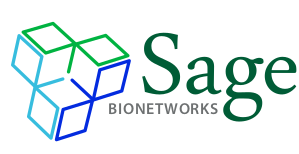
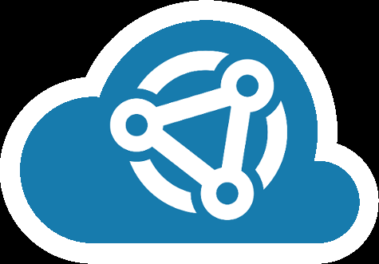
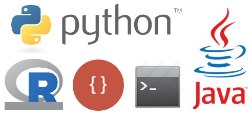

```{r setup, include=FALSE}
knitr::opts_chunk$set(echo = FALSE)
```

## Who am I?

## {data-background="img/iu_sample_gates.png"}

## {data-background="img/uci.png"}

## {data-background="img/nih_clinical_center.png"}

## {data-background="img/seattle.png"}

## 

Non-profit biomedical research institute founded in 2007, < 50 employees

<br/>

> We work to redefine how complex biological data is gathered, shared and used, redefining it through open systems, incentives, and norms.

## Our focus

> Engage <span style="color: #177bad">**diverse communities**</span> of researchers around biological and analytical problems too complex for a single institution

<br/>

> Empower <span style="color: #177bad">**citizens**</span> to track their own health and <span style="color: #177bad">**contribute**</span> deep phenotypic data to research topics important to them

## What I do @ Sage

- Community/program management and development
- Bioinformatics best practices for sharing and reproducible research
- Software development and testing
- Data analysis, genomics, statistics

## Our work

- **Community Building (in disease research)**
- DREAM Challenges (crowdsourced methods development)
- Mobile Health (development for personal medicine)

> All of these involve software and people development.

## DREAM Challenges

- Digital Mammography
- Resilience Project
- Infectious Diseases

Put logos of some challenges here

## Mobile Health

Apple ResearchKit, Android Research Stack, mPower, Parkinson's, Molemapper

## Governance
<br/>

> Data is a gift, which requires **informed consent**.

<br/>
<br/>

> **Both for data contributors and data accessors!**

## Communities

- [**AMP**|**MOVE**|**MODEL**]-AD (Alzheimer's Disease)
- **B**rain **S**omatic **M**osaicism **N**etwork
- PsychENCODE

- The Cancer Genome Atlas
- **C**hildren's **T**umor **F**oundation (Neurofibromatosis)
- Project GENIE
- CSBC / PSON

- Microenvironment Perturbagen (LINCS)

## Progenitor Cell Biology Consortium
<br/>
<br/>

> <span style="color: #177bad">7</span> institutions, <span style="color: #177bad">17</span> hub sites,<br/><span style="color: #177bad">70</span> cell lines (stem and differentiated) 

- Data coordinating center (with cell processing core)
- Analysis (with the bioinformatics core)
- Knowledge portal (through Synapse)
- Education and support

## 

> A platform for supporting scientific collaborations centered around shared biomedical data sets with a goal of making biomedical research more transparent, more reproducible, and more accessible to a broader audience of scientists.

## Cloud-enabled collaboration {data-transition="fade"}





## Projects

<br/>
<br/>
<br/>

> A collaborative and sharable workspace for organization and description of data and analysis.

http://docs.synapse.org

## Files

<br/>
<br/>
<br/>

> Scalable, federated cloud storage for any data files

http://docs.synapse.org

## Versioning

<br/>
<br/>
<br/>

> Data changes over time - can update existing files without removing or overwriting them

http://docs.synapse.org

## Organization

<br/>
<br/>
<br/>

> A familiar folder hierarchy - a common way to separate files by content or access control

http://docs.synapse.org

## Organziation

<br/>
<br/>
<br/>

> User-defined annotations (key: value pairs)<br/>enables you to search for data files<br/>across folders and projects.

<br/>

```
select id from file where cellType=='fibroblast' and dataType=='rnaSeq'
```

http://docs.synapse.org

## Access control

<br/>
<br/>

1. **Public** (view)
1. **Registered** (+ download)
1. **Certified** (+ upload)
1. **Validated** (+ research)

http://docs.synapse.org

## Access control

<br/>
<br/>
<br/>

> Decide who you want to share with through team and user-based sharing settings (or make it public)

http://docs.synapse.org

## Access control

<br/>
<br/>
<br/>

> Access restrictions that require reading and agreeing to terms of use or other data use agreements - may be a physical barrier (e.g., email a signed form)

## Attribution

<br/>
<br/>
<br/>

> Get credit for what you've done by creating and modifying things in Synapse.

http://docs.synapse.org

## Attribution

<br/>
<br/>
<br/>

> Cite the work you have contributed using a DOI on anything in Synapse!

https://www.synapse.org/pcbc

https://doi.org/dx(put DOI to PCBC project)

## Provenance

<br/>
<br/>
<br/>

> What data or code was used to create something?

http://docs.synapse.org

## Structured data

<br/>
<br/>
<br/>

> Tabular data files (spreadsheets)

http://docs.synapse.org

## Discussions

<br/>
<br/>
<br/>

> Threaded forum with integration to data files

http://docs.synapse.org

## What has been done

reference to second paper

## What has been done

reference to first paper

## What is available to you?

Show image from second paper

## Processed and summarized data

**Where you should start!**

> Rectangular matrices of samples by features for mRNA, miRNA, and methylation

Show the view

## All the data

Show the view